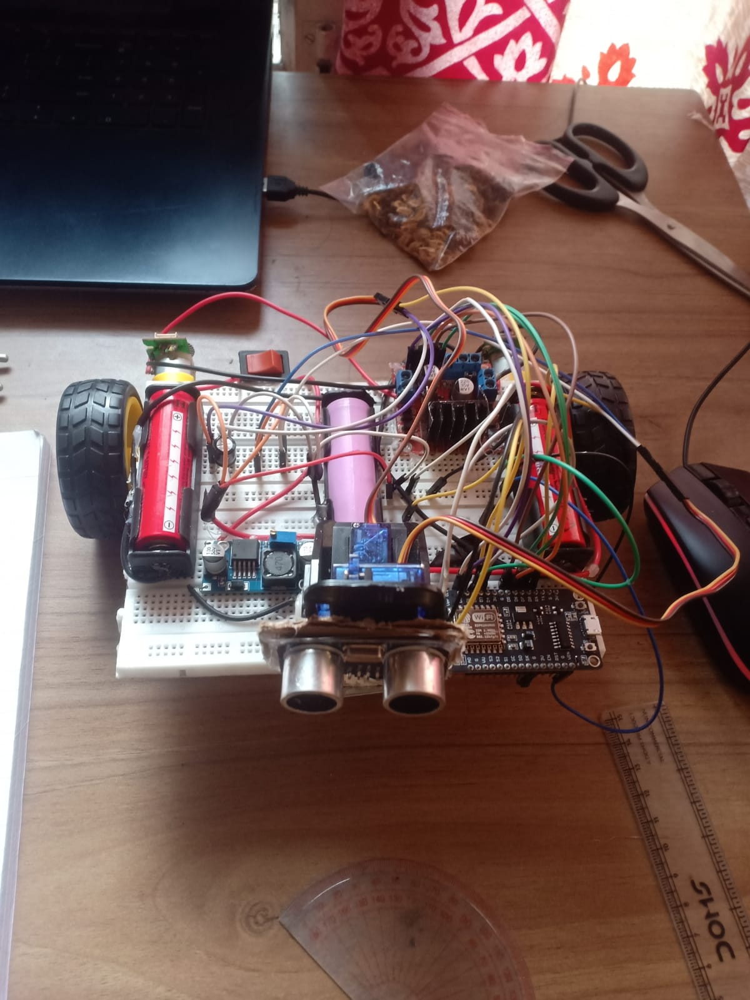

# 3d-mapping-explorer-robot
## This project was created for SET exhibition.

## For detailed algorithms see [Simple_Explanation.md](https://github.com/crazy-cat-crypto/3d-mapping-explorer-robot/blob/main/Simple_Explanation.md)
## For journal visit [Journal.md](https://github.com/crazy-cat-crypto/3d-mapping-explorer-robot/blob/main/JOURNAL.md)

## The current problems in code include:
### Very low accuracy of ultrasonic sensor, odometry algorithm and servo motors.
### The navigation code is not working well.
### Frontier algorithm is working but it cant be run as function call.
### Slam algorithm takes up a lot of processing power and doesnot work well with 2000+ readings.

## Pictures and Videos
### Click to open video

